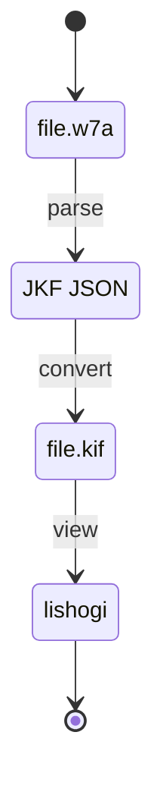

# w7a

Parses `file.w7a` to [JKF](https://github.com/na2hiro/json-kifu-format). From
thence you can go to any format, using the
[shogi-kifu-converter](https://github.com/sugyan/shogi-kifu-converter).

For me, to view on [lishogi](https://lishogi.org/), I output the resulting JSON
to [KIF](https://lishogi.org/page/kif).



## Parsing

`file.w7a` has two sections:

* [header](#header)
* [moves](#moves)

### header

#### `file.w7a`

The header in `file.w7a` is of this form

```
[Black "Habu Yoshiharu, Oi"]
[White "Namekata Hisashi, Challenger"]
[Event "54th Oi-sen, Game 1"]
[Date "July 10th and 11th 2013"]
```

The [JSON spec](https://github.com/na2hiro/json-kifu-format/blob/master/specification/json-kifu-format.schema.json)
for JKF seems not to specify any values for the header, meaning we can put
anything there (?), so we'll put the KIF header values from the `file.w7a`-data.

#### KIF

The translation to KIF of the above `file.w7a` header is

```
後手：Namekata Hisashi, Challenger
先手：Habu Yoshiharu, Oi
棋戦: 54th Oi-sen, Game 1
開始日時：2013/07/10 00:00:00
```

> n.b.: The date-format differs between w7a and KIF.

Let's build the header-parser first, then, shall we?

# Revisions

* 0.04: 2026-01-06: converter pipelines W7A header to JSON

```JSON
	"header": {
		"先手": "Namekata Hisashi, Challenger",
		"開始日時": "2013/07/10 00:00:01",
		"後手": "Habu Yoshiharu, Oi",
		"棋戦": "54th Oi-sen, Game 1" },
	"initial": {
		"preset": "HIRATE" }
```

* 0.05, 2026-01-08: Parsing the first board-piece, the pawn (parsing it well, I
might add 😎
* 0.04, 2026-01-07: started scanning w7a body; ingesting game-comment
* 0.03, 2026-01-05: serializing header and initial state to JKF
* 0.02, 2026-01-05: scanning w7a header-information
* 0.01, 2026-01-04: parsing English months and `Datish`-values; first tests

